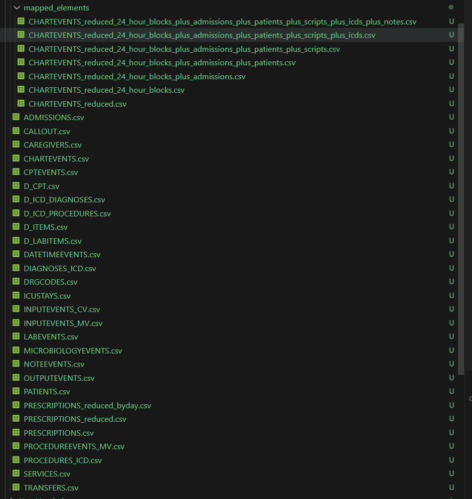

# UIUCDLH_project
This is for the project submission of UIUC 2024 Spring CS598 DLH \
Team 23 \
haixu2@illinois.edu\
kex7@illinois.edu\
sw67@illinois.edu

Github repo: https://github.com/KeXu1739/UIUCDLH_project
Video: https://mediaspace.illinois.edu/media/t/1_3xojcmph

Due to data DUA and size of the processed file, we will not include the processed data file here, but provide a guide on how to use data cleaning pipeline.

# Environment
Use Python_environment.yaml under root in conda to create the virtual environment.
Command: conda env create -f Python_environment.yaml
Virtual environment name is "tensorflow" as shown in the file.

# Data Processing
The raw data is MIMIC-III v1.4,whose access may apply through: https://mimic.physionet.org/gettingstarted/access/. Once you get the raw .csv files, save them under ./mimic_database. Use ./process_mimic.py inside this repo, which we have made modification to make it runnable.
Processed data are saved under ./mimic_database/mapped_elements.
A screenshot of the processed data file under ./mimic_database is attached here for reference.

# Model Training /Testing
To get benchmark model from the paper: Run ./rnn_mimic.py under this repo, again, necessary modification has been done to allow it to run locally. The script will train the large model for all 3 predictors, as well as using reduced size inputs to train several smaller models.
The trained model objects will be saved under: ./saved_models.

To get the models for ablation study, please follow the runs specification below:
1. Removing attention from the model: run ./rnn_mimic_noAtten.py
2. Varying LSTM unit: run ./rnn_mimic_LSTMUnit.py
3. Varying number of epochs, learning rate and rho in training: run the ./test_epochs.bat, ./test_learning_rate.bat and ./test_rho.bat accordingly, which pass different parameter to the ./rnn_mimic_hyper_test.py script and train models with different set-ups.

# Results
The different part of the results can be obtained in the following ways:

1. The results replicating the original paper: run the code blocks from ./Final_report.ipynb, plots and results will be shown directly in the notebook.
2. Varying LSTM unit as ablation study: run ./LSTMUnit_scripts.ipynb, the comparison of the ROC AUC curve will be shown in the notebook (which is not shown in the final report), together with a stats_LSTMUnits.csv file that records all the roc_auc value from different models, the original output is saved under ./output_for_report folder. The roc_auc is summarized in the ablation study section of the final report.

3. Varying hyper-paramters as ablation study: we ran the model using .bat files and picked the accuracy results from the output directly, a portion of the original intermediate results are saved into .txt files under ./output_for_report.

Please refer to the final report for the summary.

